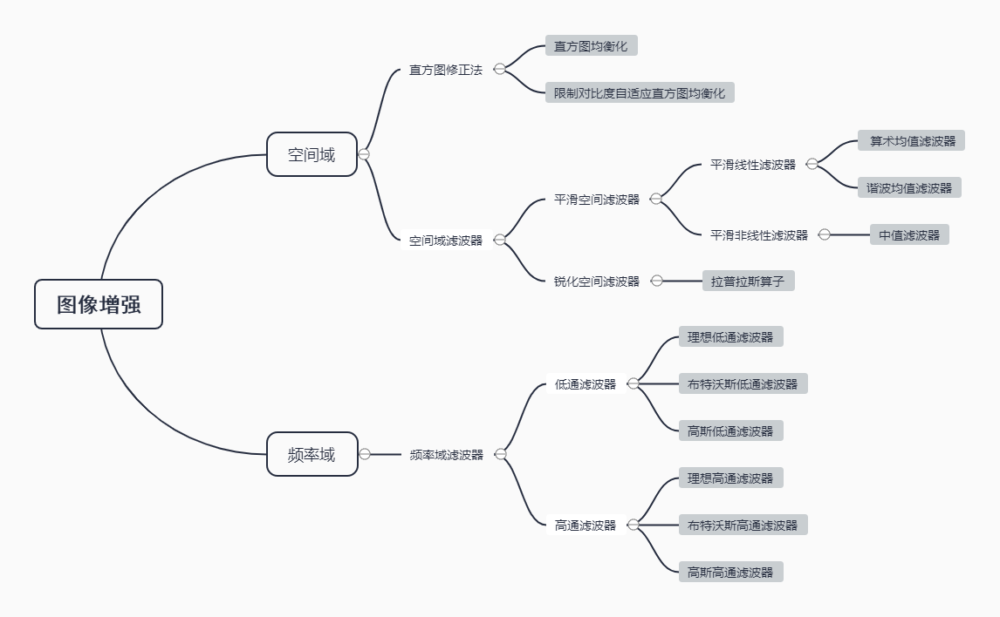
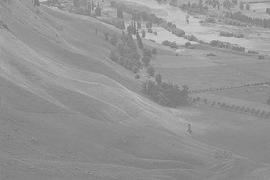
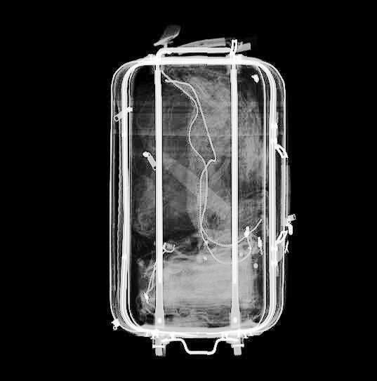

# 实验一：破损/模糊图像增强实验

## 一、概要

### 1.图像增强

图像增强就是指通过某种图像处理方法对退化的某些图像特征，如边缘、轮廓、对比度等进行处理，以改善图像的视觉效果，提高图像的清晰度，或是突出图像中的某些“有用”，压缩其他“无用”信息，将图像转换为更适合人或计算机分析处理的形式。

图像增强可以分为两类：空间域法和频域法。

#### 1.1空间域

空间域可以简单地理解为包含图像像素的空间，空间域法是指空间域中，也就是图像本身，直接对图像进行各种线性或非线性运算，对图像的像素灰度值做增强处理。

空间域法又分为点运算和模板处理两大类。点运算是作用于单个像素邻域的处理方法，包括图像灰度变换、直方图修正、伪彩色增强技术；模板处理是作用于像素领域的处理方法，包括图像平滑、图像锐化等技术。

#### 1.2频率域

频域法则是在图像的变换域中把图像看成一种二维信号，对其进行基于二维傅里叶变换的信号增强。对其进行基于二维傅里叶变换的信号增强。

频域法常用的方法包括低通滤波、高通滤波以及同态滤波等。

## 二、实验工具

### 1.Numpy

**Numpy** 的英文全称为 **Numerical Python**，指Python 面向数值计算的第三方库。Numpy 的特点在于，针对 Python 内建的数组类型做了扩充，支持更高维度的数组和矩阵运算，以及更丰富的数学函数。Numpy 是 Scipy.org 中最重要的库之一，它同时也被 Pandas，Matplotlib 等我们熟知的第三方库作为核心计算库。
NumPy（Numeric Python）提供了许多高级的数值编程工具，如：矩阵数据类型、矢量处理，以及精密的运算库。专为进行严格的数字处理而产生。多为很多大型金融公司使用，以及核心的科学计算组织如：Lawrence Livermore，NASA用其处理一些本来使用C++，Fortran或Matlab等所做的任务。

#### **版本**

1.20.3

### 2.Matplotlib

**Matplotlib** 是一个在 python 下实现的类 matlab 的纯 python 的第三方库,旨在用 python实现matlab 的功能，是python下最出色的绘图库。其风格跟 matlab 相似，同时也继承了 python 的简单明了。

#### 版本

3.4.3 

### 3.opencv-python

**OpenCV**是一个历史悠久、功能丰富、社区活跃的开源视觉开发库。一方面，它提供了计算机视觉以及图像处理方面最常用最基础的功能支持，是开发的必备工具；另一方面，它在新版本中紧跟潮流，加入对新的算法、硬件的支持（v3.3 正式引入 DNN）。

**OpenCV** 基于 C++ 编写，但提供了 Python、Ruby、MATLAB 等多种语言接口。这对于习惯使用 Python 开发的人工智能从业者来说非常方便。

#### 版本

4.6.0.66

## 三、实验步骤



本实验按图像增强方法分为三类

- 直方图修正法
- 空间域滤波器
- 频率域滤波器

### 1.直方图修正法

**直方图修正**的目的是，使修正后的图像的灰度间距拉开或者是图像灰度分布均匀，从而增大反差，使图像细节清晰，从而达到图像增强的目的。

#### 1.1直方图均衡化（HE）

##### 1.1.1概念

**直方图均衡化**是图像处理领域中利用**图像直方图**对**对比度**进行调整的方法。

直方图均衡就是从图像的灰度图入手，建立一个0~255灰度值的直方图，统计每个灰度值在直方图中出现的次数，将灰度图中对应点的灰度值记录在直方图中，接着对该直方图进行均衡化操作，使像素的灰度值分布得更加均匀，从而增强图像整体对比度效果，使图像更加清晰。为了将原图像的亮度范围进行扩展， 需要一个映射函数， 将原图像的像素值均衡映射到新直方图中， 这个映射函数有两个条件：

1. 不能打乱原有的像素值大小顺序， 映射后亮、 暗的大小关系不能改变；
2. 映射后必须在原有的范围内，即像素映射函数的值域应在0和255之间；

综合以上两个条件，累积分布函数是个好的选择，因为累积分布函数是单调增函数（控制大小关系），并且值域是0到1（控制越界问题），所以直方图均衡化中使用的是累积分布函数。

##### 1.1.2累积分布函数

因为图像由一个个像素点组成，所以图像直方图均衡化是通过离散形式的累积分布函数求解的，直方图均衡化过程中，映射方法是：

$$
s_{k}=\sum_{j=0}^{k} \frac{n_{j}}{n} \quad k=0,1,2, \cdots, L-1
$$
其中，$s_k$指当前灰度级经过累积分布函数映射后的值，$n$是图像中像素的总和，$n_j$是当前灰度级的像素个数，$L$是图像中的灰度级总数。

##### 1.1.3 直方图均衡化的步骤

1. 依次扫描原始灰度图像的每一个像素， 计算出图像的灰度直方图；
2. 计算灰度直方图的累积分布函数；
3. 根据累积分布函数和直方图均衡化原理得到输入与输出之间的映射关系;
4. 最后根据映射关系得到结果进行图像变换。

##### 1.1.4代码块

```python
def HistogramEqualization(img, name):
    """
    直方图均衡化函数
    :param imgs: 输入图片
    :param name: 目录
    :return:均衡化处理后的图片
    """
    equ = cv2.equalizeHist(img)
    cv2.imwrite(f'images/HistogramEqualization/{name}/HistogramEqualization.png', equ)
    return equ
```

#### 1.2限制对比度自适应直方图均衡化（CLAHE）

##### 1.2.1原理

原理与直方图均衡化差不多，但他跟直方图均衡化不同是在分块之后统计累积分布函数后会进行裁剪，即在选定的直方图bins(例如（0~255内）CDF的值进行限制，改变CDF的梯度，再局部均衡化。

普通的直方图均衡化往往会放大图像近恒定区域中的对比度，因为此类区域中的直方图高度集中。结果，直方图均衡化可能导致噪声在近恒定区域中被放大。限制对比度自适应直方图均衡化是自适应直方图均衡的一种变体，其中对比度放大受到限制，从而减少了这种噪声放大问题。

##### 1.2.2CLAHE步骤

1. 分块。将输入图像划分为大小相等的不重叠子块，每个子块含有的像素数为M；
2. 计算子块直方图;
3. 计算剪切阈值clipLimit;
4. 像素点重分配。对每个子块，使用步骤三中多余的像素重新分配;
5. 直方图均衡;
6. 像素点灰度值重构。

##### 1.2.3代码块

```python

def Clahe(img, name):
    """
    有限对比适应性直方图均衡化
    :param imgs:输入图片
    :param name:目录
    :return:均衡化处理后的图片
    """
    clahe = cv2.createCLAHE(clipLimit=2.0, tileGridSize=(8, 8))
    cls = clahe.apply(img)
    cv2.imwrite(f'images/HistogramEqualization/{name}/Clahe.png', cls)
    return cls
```

### 2.空间域滤波器

#### 2.1背景知识

##### 2.1.1算子

空间域处理可由下式表示：
$$
g(x, y)=T[f(x, y)]
$$
$f(x,y)$)是输入图像，$ g(x,y)$是处理后的图像，$T$是在点$ (x,y)$的邻域上定义的关于$f$的一种算子。算子可应用于单幅图像或图像集合。

##### 2.1.2空间域

术语空间域指图像平面本身，这类图像处理方法直接操作图像中的像素。

#### 2.2平滑空间滤波器

   平滑滤波器用于模糊处理和降低噪声。模糊处理经常用于预处理任务中。通过线性滤波和非线性滤波模糊处理，可以降低噪声。

##### 2.2.1平滑线性滤波器

平滑线性空间滤波器的输出（响应）是包含在滤波器模板邻域内的像素的简单平均值。这些滤波器有时也称为均值滤波器。

令 $S_{xy}$  表示中心在点 $(x,y)$处、大小为 $m\times n $的矩形子图像窗口（邻域）的一组坐标。

###### 2.2.1.1算术均值滤波器

 一副 $ M\times N$ 图像经过一个 $m \times n$（$m$ 和 $n$ 是奇数）的算术均值滤波器的过程可由下式给出：
$$
g(x, y)=\frac{1}{m n} \sum_{(x, y) \in S_{x y}} f(x, y)
$$

###### 2.2.1.2谐波均值滤波器

$$
g(x, y)=\frac{m n}{\sum_{(x, y) \in S_{x y}} \frac{1}{f(x, y)}}
$$

##### 2.2.2平滑非线性滤波器

###### 2.2.2.1中值滤波器

 中值滤波器使用一个像素邻域中的中值代替图像中的值，表达式如下：
$$
g(x, y)=\operatorname{median}_{(x, y) \in S_{x y}} f(x, y)
$$
中值滤波器的应用非常普遍，因为对于某些类型的随机噪声，它们能提供良好的去噪能力，且与相同尺寸的线性平滑滤波器相比，引起的模糊更少。

##### 2.2.3平滑空间滤波器代码块

```python
def SpatialDomain(img_name):
    '''

    :param img_name: 图片列表
    :return:
    '''
    for name in img_name:
        img = cv2.imread(f'images/SpatialDomain/{name}.png', 0)

        # 算数均值滤波
        img1 = cv2.blur(img, (3, 3))
        # 谐波均值滤波器
        img2 = 1 / cv2.blur(1 / (img + 1E-10), (3, 3))  # 加1E-10防止除0操作
        # 中值滤波
        img3 = cv2.medianBlur(img, 3)
        imgs = {name: img, '算数均值滤波': img1, '谐波均值滤波': img2, '中值滤波': img3}
        Saveplt(imgs, name)
        HistogramEqualization.HistogramShow(imgs, f'SpatialDomain/{name}')

```


#### 2.3锐化空间滤波器

 锐化处理的主要目的是突出灰度的过渡部分。在逻辑上，我们得出锐化处理可由空间微分来实现。基本上，微分算子的响应强度与图像在用算子操作的这一点的突变程度成正比，这样，图像微分会增强边缘和其他突变（如噪声），削弱灰度变化缓慢的区域。
      一维函数$ f(x)$ 的一阶微分的基本定义是差值：
$$
\frac{\partial f}{\partial x}=f(x+1)-f(x)
$$

##### 2.3.1拉普拉斯算子

 拉普拉斯算子使用二阶微分锐化图像。一个二维图像函数 $f(x,y)$ 的拉普拉斯算子定义为：
$$
\nabla^{2} f=\frac{\partial^{2} f}{\partial x^{2}}+\frac{\partial^{2} f}{\partial y^{2}}
$$
因为任意阶微分都是线性操作，所以拉普拉斯变换也是一个线性算子。为了以离散形式描述这一公式，在 $x$ 方向上，有
$$
\frac{\partial^{2} f}{\partial x^{2}}=f(x+1, y)+f(x-1, y)-2 f(x, y)
$$
在 $y$ 方向上，有
$$
\frac{\partial^{2} f}{\partial y^{2}}=f(x, y+1)+f(x, y-1)-2 f(x, y)
$$

##### 2.3.2拉普拉斯算子代码块

```python
def Laplacian(name):
    '''

    :param name: 原图片的命名
    :return:
    '''
    img = cv2.imread(f'images/SpatialDomain/{name}.bmp', 0)
    kernel = np.array([[-1, -1, -1], [-1, 8, -1], [-1, -1, -1]])
    edge_img = cv2.filter2D(img, -1, kernel)
    output_img = cv2.add(img, edge_img)
    imgs = {'Raw':img,'edge':edge_img,'output':output_img}
    plt.figure()
    i = 1
    for key, value in imgs.items():
        plt.subplot(1, 3, i)
        i += 1
        plt.imshow(value, cmap="gray")
        plt.title(key)
        plt.xticks([])
        plt.yticks([])
    plt.tight_layout()
    plt.savefig('images/SpatialDomain/Laplacian.png')
    HistogramEqualization.HistogramShow(imgs,f'SpatialDomain/Laplacian')


```

### 3.频率域滤波器

#### 3.1背景知识

##### 3.1.1傅里叶级数

设$ f(x)$ 以$ 2\pi$ 为周期，在 $ [-\pi, \pi]$绝对可积，则由公式
$$
\begin{array}{c}
a_{n}=\frac{1}{\pi} \int_{-\pi}^{\pi} f(x) \cos n x d x, \quad n=0,1,2, \ldots \\
b_{n}=\frac{1}{\pi} \int_{-\pi}^{\pi} f(x) \sin n x d x, \quad n=1,2, \ldots
\end{array}
$$
决定的 $a_n$ 、$ b_n$  称为傅里叶系数，称由这些 $a_n$ 、$b_n$决定的三角级数
$$
f(x) \sim \frac{a_{0}}{2}+\sum_{n=1}^{\infty}\left(a_{n} \cos n x+b_{n} \sin n x\right)
$$
为 $f(x)$ 的傅里叶级数。


##### 3.1.2频率域

频率域的图像处理首先把一副图像变换到**频率域**，在频率域中进行处理，然后通过反变换把处理结果返回到**空间域**。

##### 3.1.3基本滤波公式

频率域滤波是指先修改一副图像的**傅里叶变换**，然后计算其反变换，得到处理后的结果。由此，若给定一副大小为$M\times N$的数字图像$ f(x, y)$，则基本滤波公式有如下形式：
$$
g(x, y)=\zeta^{-1}[H(u, v) F(u, v)]
$$
式中，$\zeta^{-1}$是IDEF(傅里叶反变换)，$ F(u,v)$ 是输入图像 $ f(x,y)$ 的DEF(离散傅里叶变换)，$ H(u,v)$ 是滤波函数（简称为滤波器或滤波传递函数），$g(x,y)$ 是滤波后的输出图像。函数$F$、$ H$ 和 $ g$是大小与输入图像相同的 $M\times N$阵列。


##### 3.1.4滤波步骤

1. 选择滤波器 $H(u,v)$:

   所有的滤波函数 $H(u,v)$ 可理解为大小为 $P\times Q$的离散函数，即离散频率变量的范围是 $u=0,1,2,...,P-1$ 和 $ v=0,1,2,...,Q-1$。

2. 填充$f(x,y)$：

   通常选择$P=2M$、$ Q=2N$，并对$ f(x,y)$)添加必要数量的0，形成大小为 $P\times Q$的图像。

3. 求$f(u,v)$ 的DEF $\rightarrow F(u,v)$

4. 改变 $F(u,v)$的原点至中心：

   换位，将 $ F(u,v)$的低频部分移到中间，高频部分移到四周，以便后面的计算。

5. 计算 $ F ( u , v ) $$H(u,v)$

6. 改变 $H(u,v)F(u,v)$ 的原点至左上角：

   对$ H(u,v)F(u,v)$ 的结果进行换位，得到初始时图像的DEF的数据排列形式，即低频部分在四周，高频部分在中间（原点在左上角意味着低频部分在左上角，又因为的DEF是中心对称的，可得初始时图像的DEF应是低频在四周高频在中间）。

7. 求$ H(u,v)F(u,v)$ 的IDEF $ \rightarrow g(x,y)$：

   此时求得的IDEF是一个复数，我们需计算每一个元素的幅度（实部和虚部平方和的平方根），并提取左上角的 $M\times N$ 区域，得到最终的输出图像 $g(x,y)$。

#### 3.2低通滤波器

##### 3.2.1理想低通滤波器

 在以原点为圆心、以 $D_0$为半径的圆内，无衰减地通过所有频率，而在该圆外“阻断”所有频率的二维低通滤波器，称为理想低通滤波器（ILPE）。它由下面的函数确定：
$$
H(u, v)=\left\{\begin{array}{ll}
1, & D(u, v) \leq D_{0} \\
0, & D(u, v)>D_{0}
\end{array}\right.
$$
式中，$D_0$是一个正常数，$D(u,v)$是频率域中点 $ (u,v)$ 与频率矩形中心的距离，即
$$
D(u, v)=\left[(u-P / 2)^{2}+(v-Q / 2)^{2}\right]^{\frac{1}{2}}
$$

##### 3.2.2布特沃斯低通滤波器

截止频率位于距原点 $D_0$处的n阶布特沃斯低通滤波器（BLPF）的传递函数定义如下：
$$
H(u, v)=\frac{1}{1+\left[D(u, v) / D_{0}\right]^{2 n}}
$$
式中，$D(u,v)$是距频率矩形中心的距离。与ILPF不同，BLFP传递函数并没有在通过频率和滤除频率之间给出明显截止的急剧不连续性。

##### 3.2.3高斯低通滤波器

二维高斯低通滤波器（GLPF）形式如下：
$$
H(u, v)=e^{-D^{2}(u, v) / 2 \sigma^{2}}
$$
式中，$D(u,v)$ 是距频率矩形中心的距离，$\sigma$是关于中心的扩展度的度量。

#### 3.3高通滤波器

##### 3.3.1理想高通滤波器

二维理想高通滤波器（IHPE）定义为：
$$
H(u, v)=\left\{\begin{array}{ll}
0, & D(u, v) \leq D_{0} \\
1, & D(u, v)>D_{0}
\end{array}\right.
$$
式中，$D_0$是截止频率，$D(u,v)$是距频率矩形中心的距离。


##### 3.3.2布特沃斯高通滤波器

截止频率为$D_0$处的n阶布特沃斯高通滤波器（BHPF）定义为：

$$
H(u, v)=\frac{1}{1+\left[D_{0} / D(u, v)\right]^{2 n}}
$$
式中，$D(u,v)$ 是距频率矩形中心的距离。


##### 3.3.3高斯高通滤波器

二维高斯高通滤波器（GHPF）定义为：
$$
H(u, v)=1-e^{-D^{2}(u, v) / 2 \sigma^{2}}
$$
式中，$D(u,v)$是距频率矩形中心的距离，$\sigma$ 是关于中心的扩展度的度量。

#### 3.4频率域滤波器代码块

```python
'''
计算D(u,v)
'''


def fft_distances(m, n):
    u = np.array([i - m / 2 for i in range(m)], dtype=np.float32)
    v = np.array([i - n / 2 for i in range(n)], dtype=np.float32)
    ret = np.ones((m, n))
    for i in range(m):
        for j in range(n):
            ret[i][j] = np.sqrt(u[i] * u[i] + v[j] * v[j])
    u = np.array([i if i <= m / 2 else m - i for i in range(m)], dtype=np.float32)
    v = np.array([i if i <= m / 2 else m - i for i in range(m)], dtype=np.float32)
    return ret


'''
步骤① ：选择低通滤波器
'''


def change_filter(flag):
    # 理想低通滤波器
    if flag == 1:
        # 初始化滤波器，因为fft_mat有2个通道，filter_mat也需要2个通道
        filter_mat = np.zeros((nrows, ncols, 2), np.float32)
        # 将filter_mat中以(ncols/2, nrows/2)为圆心、d0为半径的圆内的值设置为1
        cv2.circle(filter_mat, (np.int_(ncols / 2), np.int_(nrows / 2)), d0, (1, 1, 1), -1)
    # 布特沃斯低通滤波
    elif flag == 2:
        n = 2  # 2阶
        filter_mat = None
        duv = fft_distances(*fft_mat.shape[:2])
        filter_mat = 1 / (1 + np.power(duv / d0, 2 * n))
        filter_mat = cv2.merge((filter_mat, filter_mat))  # fliter_mat 需要2个通道
    # 高斯低通滤波（σ为d0）
    else:
        filter_mat = None
        duv = fft_distances(*fft_mat.shape[:2])
        filter_mat = np.exp(-(duv * duv) / (2 * d0 * d0))
        filter_mat = cv2.merge((filter_mat, filter_mat))  # fliter_mat 需要2个通道
    return filter_mat


'''
对图像进行傅里叶反变换，返回反变换图像
步骤⑥ ：对fft_mat进行换位，低频部分移到四周，高频部分移到中间
步骤⑦ ：傅里叶反变换，并计算幅度，提取左上角的 M×N 区域
'''


def ifft(fft_mat):
    # 反换位，低频部分移到四周，高频部分移到中间
    f_ishift_mat = np.fft.ifftshift(fft_mat)
    # 傅里叶反变换
    img_back = cv2.idft(f_ishift_mat)
    # 将复数转换为幅度, sqrt(re^2 + im^2)
    img_back = cv2.magnitude(*cv2.split(img_back))
    # 标准化到0~255之间
    cv2.normalize(img_back, img_back, 0, 255, cv2.NORM_MINMAX)
    return np.uint8(np.around(img_back))[:rows, :cols]


'''
选择不同的滤波器对图像进行滤波
flag:1理想低通 2布特沃斯低通 3高斯低通
利用 HP+LP=1可计算高频滤波器
对滤波后的结果进行傅里叶反变换，得到输出图像
'''
img1 = ifft(change_filter(1) * fft_mat)  # 理想低通
img2 = ifft(change_filter(2) * fft_mat)  # 布特沃斯低通
img3 = ifft(change_filter(3) * fft_mat)  # 高斯低通
img4 = ifft((1 - change_filter(1)) * fft_mat)  # 理想高通
img5 = ifft((1 - change_filter(2)) * fft_mat)  # 布特沃斯高通
img6 = ifft((1 - change_filter(3)) * fft_mat)  # 高斯高通

```

## 四、算法对比实验结果

### 1.直方图修正法

直方图修正法包括两个算法：直方图均衡化（HE）、限制对比度自适应直方图均衡化（CLAHE），输入图像包括P1、P2两张

#### 1.1原图

P1：


P2:



#### 1.2直方图均衡化

通过**直方图均衡化**算法后修正的图片如下：

P1:



P2:


#### 1.3限制对比度自适应直方图均衡化

通过**限制对比度自适应直方图均衡化**算法后修正的图片如下：

P1：


P2：


#### 1.4直方图对比

P1：


P2：


#### 1.5实验分析

P1类似于X光机检测出来的图片，P2是年代久远的老照片，都无法看清具体信息，存在曝光度低，对比度不够的问题。

上述实验结果包含了，P1与P2通过直方图均衡化、限制对比度自适应直方图均衡化算法分别进行调整后得到的图片，观感上得到明显改善，对于P1X光图片能够更清晰的看清内部具体信息，直方图均衡化可以有效地改善图片。

为了能够更直观的看到图片的调整，实验选择通过使用直方图来量化曝光量，能够真实、科学的看出图片的曝光情况。由于P1X光图片整体颜色较少，通过P2能够更直观的观察到直方图修正法对于图片的调整，直方图均衡化的中心思想就是把原始图像的灰度直方图从比较集中的某个灰度区间编程在全部灰度范围内的均匀分布。通过观察cdf曲线可以看出，直方图均衡化的cdf曲线，基本都是线性的。与原图直方图中集中在某一亮度区间的情况相比，直方图均衡化以及Clahe都可以改善这种情况，Clahe设置了限制对比度，生成的图片看起来更舒服一些。

### 2.空间域滤波器

#### 1.1原图


为了能直观的观察到空间域滤波的效果，我们在原图本身分别添加两种噪声：盐噪声、椒噪声

#### 1.2噪声图片

添加噪声代码：

```python
def addsalt_pepper(img, SNR):
    img_ = img.copy()
    c, h, w = img_.shape
    mask = np.random.choice((0, 1, 2), size=(1, h, w), p=[SNR, (1 - SNR) / 2., (1 - SNR) / 2.])
    mask = np.repeat(mask, c, axis=0)  # 按channel 复制到 与img具有相同的shape
    img_[mask == 1] = 255  # 盐噪声
    img_[mask == 2] = 0  # 椒噪声
    return img_


```

椒盐噪声是数字图像中的常见噪声，一般是由图像传感器、传输信道及解码处理等产生的黑白相见的亮暗点噪声，椒盐噪声常由图像切割产生。椒盐噪声是指两种噪声：盐噪声（salt noise）及椒噪声（pepper noise）。盐噪声一般是白色噪声，椒噪声一般是黑色噪声，前者高灰度噪声，后者属于低灰度噪声，一般两种噪声同时出现，呈现在图像上就是黑白杂点。添加噪声的细节不涉及图像增强内容，不在实验报告中赘述，具体参考[椒盐噪声识别与滤波算法改进的研究](https://kns.cnki.net/kcms/detail/detail.aspx?dbcode=CMFD&dbname=CMFD202101&filename=1020656161.nh&uniplatform=NZKPT&v=PC7TDL96Hf-1f2o5lggz9jkbphAi2mOmcSfu-PkyIhvpt55M23QQ2cZrQN1OTT0j)

**盐噪声图片：**


**椒噪声图片：**


**椒盐噪声图片：**


#### 1.3平滑空间域滤波器

平滑空间域滤波器使用算数均值滤波器、谐波均值滤波器、中值滤波器来进行图像增强

对于**盐噪声图片**：


对于椒噪声图片：


对于椒盐噪声图片：


**均值滤波**又称作邻域平均法，是典型的**线性滤波算法**，理想的均值滤波是用每个像素和它周围像素计算出来的平均值替换图像中每个像素。从频率域观点来看均值滤波是一种低通滤波器（让图像的低频部分通过，通常弱化边缘，会得到比较平缓的图像），高频信号将会去掉，因此可以**帮助消除图像尖锐噪声**，实现图像平滑，模糊等功能。因为此方法不能很好地保护图像细节，**在图像去噪的同时也破坏了图像的细节部分**，从而使图像变得模糊。

优势：消除尖锐噪声，实现图像平滑，模糊等功能。

**中值滤波**也是消除图像噪声最常见的手段之一，是**非线性滤波算法**。对于消除椒盐噪声，**中值滤波的效果要比均值滤波更好**。它的基本原理是计算出数字图像中的一点的一个邻域中的各点值的中值（中间值），并使用该中值将将该点原值代替。可以理解为使用一个窗口沿图像移动，用窗口内所有象素灰度的中值来代替窗口中心位置的象素灰度。

优势：消除椒盐噪声。

 **谐波平均滤波器**属于均值滤波器，但通过实验结果来看可以处理盐粒噪声，但是**不能处理椒噪声**。

**为什么不能处理胡椒噪声？**

谐波平均滤波器算法：
$$
g(x, y)=\frac{m n}{\sum_{(x, y) \in S_{x y}} \frac{1}{f(x, y)}}
$$


假设图像包含胡椒噪声，也就是很多突变成黑色的点，这里取极端情况灰度值都为0的胡椒噪声。那么在谐波平均滤波器处理这些点的时候， g 就会变成很小的值（代码里会加上一个极小值，防止分母为0），所以整个表达式还是会返回一个灰度值很低的黑点。


#### 1.4锐化空间滤波器


前面的几种滤波器都属于平滑滤波器（低通滤波器），用来平滑图像和抑制噪声的；而锐化空间滤波器恰恰相反，主要用来**增强图像的突变信息**，**图像的细节和边缘信息**。平滑滤波器主要是使用邻域的均值（或者中值）来代替模板中心的像素，消弱和邻域间的差别，以达到平滑图像和抑制噪声的目的；相反，锐化滤波器则使用邻域的微分作为算子，增大邻域间像素的差值，使图像的突变部分变的更加明显。简单来说，平滑滤波器适合处理图片噪声，而锐化滤波器适合用来图像增强。

### 3.频率域滤波器

##### 1.1原图


##### 1.2低通滤波器

###### 理想低通滤波器


###### 布特沃斯低通滤波器


###### 高斯低通滤波器


##### 1.3高通滤波器

###### 理想高通滤波器


###### 布特沃斯高通滤波器


###### 高斯高通滤波器


##### 1.4综合对比


我们知道，在一幅图像中，其低频成分对应者图像变化缓慢的部分，对应着图像大致的相貌和轮廓。而其高频成分则对应着图像变化剧烈的部分，对应着图像的细节（图像的噪声也属于高频成分）。

低频滤波器，顾名思义，就是过滤掉或者大幅度衰减图像的高频成分，让图像的低频成分通过。低频滤波器可以平滑图像，虑去图像的噪声。而与此相反的高频滤波器，则是过滤低频成分，通过高频成分，可以达到锐化图像的目的。

**理想低通滤波器**的滤波非常尖锐，而**高斯低通滤波器**的滤波则非常平滑。**布特沃斯低通滤波器**则介于两者之间，当布特沃斯低通滤波器的阶数较高时，接近于理想低通滤波器，阶数较低时，则接近于高斯低通滤波器。

图像边缘化其它灰度的急剧变化与高频分量有关，因此可以在频率域通过高通滤波实现图像锐化。高通滤波衰减傅里叶变换中的低频分量而不干扰高频信息。

观察**理想高通滤波器**的效果图，我们可以看到，与理想低通滤波器一样，所得到的图像有很明显的振铃现象。结果图像从视觉上来看，有些偏暗，这是因为图像的直流分量被滤掉的原因。**高斯高通滤波器**的过度特性很好，所以不会发生振铃现象。**布特沃斯低通滤波器**仍介于两者之间，若参数调整过大也会产生振铃现象。

## 五、实验结果分析

### 1.1空间域滤波简介

​    空间域滤波是在图像空间中借助模板对图像进行邻域操作,处理图像的每一个像素的取值都是根据模板对输入像素邻域内的像素值进行加权叠加得到的，空间域滤波是应用模板卷积对图像每一个像素进行局部处理。

### 1.2频域滤波器简介

 频域滤波是图像经傅里叶变换后,边缘和其他尖锐信息在图像中主要出于高频部分,因此,可以通过衰减图像傅里叶变换中的高频成分的范围来实现。

### 1.3频域滤波与空间域滤波的比较

-  在空间域滤波中,平滑滤波器算法简单,处理速度快,但在降噪同时使图像产生模糊,特别是在边缘和细节处。中值滤波器对椒盐噪声抑制效果比较好,但对点、线等细节较多的图像却不太合适。低通滤波器对椒盐噪声过滤效果差,图像较为模糊。空间域滤波算法简单,处理速度较快,在锐化方面效果明显,线条突出。
- 在频域滤波中,去噪同时将会导致边缘信息损失,使图像边缘模糊,并且产生振铃效果。频域滤波算法复杂,计算速度慢,有微量振铃效果,图像平缓。

### 1.4频域滤波与空间域滤波的联系

频域滤波较空域而言更为直观,频域下滤波器表达了一系列空域处理(平滑、锐化等)的本质,即对高于/低于某一特定频率的灰度变化信息予以滤除,而对其他的灰度变化基本保持不变。这种直观性增加了频域滤波器设计的合理性,使得我们更容易设计出针对特定问题的频域，而想直接在空域中设计出一个能够完成滤波任务的滤波器(卷积模板)是相当困难的。

为了得到合适的空域滤波器,可以首先设计频域滤波器$H(u, v)$而后根据卷积定理,将$H(u, v)$反变换至空域后就得到了空域中滤波使用的卷积模板$h(x, y)$,从而解决空域滤波器的设计难题。然而,直接反变换得到的空域卷积模板$h(x, y)$同$H(u, v)$等大,要计算这样大的模板与图像的卷积将是非常低效的。利用以全尺寸的空域滤波器$h(x, y)$为指导设计出的形状与之类似的小空域卷积模板,同样可以取得类似于频域滤波器$H(u, v)$的滤波效果，这就为从频域出发,最终设计出具有实用价值的空域模板提供了一种完美的解决方案。

